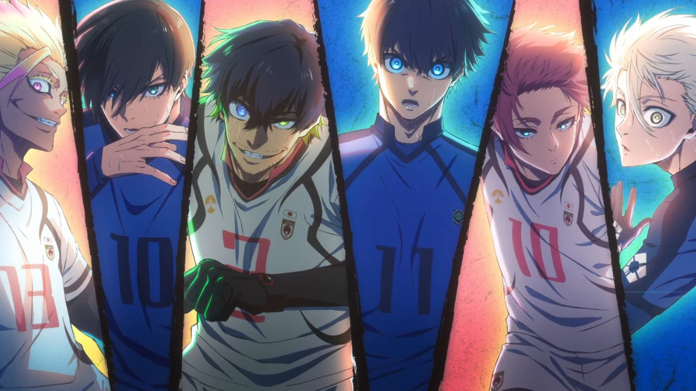

# ⚡ Miguel Lima · Dev Portfolio

  
  

  

## 🧩 Sobre o Projeto
Este é o meu portfólio pessoal, focado em um design moderno com estética **Glassmorphism** e inspirado na cultura **Anime**. O objetivo é demonstrar minhas habilidades em UI/UX e desenvolvimento Front-end.

> "Acredito que bom código, assim como um bom anime, precisa de história, ritmo e impacto."

---

## 🚀 Tecnologias Utilizadas
Abaixo as ferramentas que deram vida a este projeto:

* **HTML5 / CSS3** (Layout responsivo e animações)
* **JavaScript** (Efeito de digitação e interatividade)
* **Figma** (Prototipagem do design)
* **Google Fonts** (Fontes Rajdhani e Noto Serif JP)

---

## 🎨 Preview do Design
O projeto conta com:
- [x] Efeito Parallax suave no fundo.
- [x] Sistema de partículas dinâmicas.
- [x] Navegação responsiva (Mobile Friendly).
- [x] Temática Dark mode integrada.

---

## 🛠️ Como rodar o projeto localmente
Se quiser testar na sua máquina:
1. Clone este repositório: 
   `git clone https://github.com/MiguelLima01/Portif-lio.git`
2. Abra o arquivo `index.html` no seu navegador.

---

## ✉️ Contato
Estou sempre aberto a novos projetos e conversas sobre Tech (e Animes, claro!).

---

Feito com ♥, café e muitas OSTs de Anime no loop. 🎧

